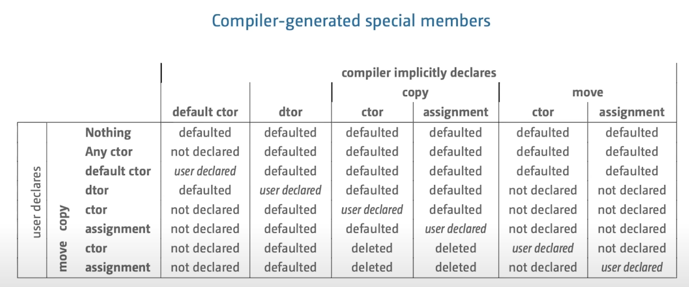

# [Back To Basics: Move Semantics](https://www.youtube.com/watch?v=knEaMpytRMA)

## intuition

* move or duplicate?
  * use example of moving an house
* what exactly is move?
```cpp
template<typename T>
constexpr std::remove_reference<T>::type&& move(T&& t) noexpect // T&& is universal reference
{
    return static _cast<typename std::remove_reference<T>::type&&>(t)
}
```
* calling move doesn't mean you loss everything or there is real move happening, it's just about triggering the right **overload** 

## value category

* c++98
  * lvalue
  * rvalue
* modern c++
  * xvalue - expiring value
  * prvalue - pure rvalue
  * glvalue - lvalue or xvalue
  * rvalue - xvalue or prvalue

## An example for potential performance win
* string
  * string copy is usually very costy
  * string move

## simple rule of move
* simple rule: don't use the object after it has been moved (assuming destructible move semantics)
* moved-from object is an object
* moved-from object is in **unknown** but valid state

## More example
* STL container of custom types
  * exception safe
  * rule: might require noexcept on Move assignment, Move constructor for better performance
  * reason: STL takes exception safety seriously
* std::move is not always the right thing
  * std::forward
    * forwarding the value and preserving the original value category

## compiler generated code
* move doesn not a have default implementation (compiler generated) if user provides an own destructor
* rule of 5 or rule of 0

## Utilizing move semantics
* building functional paatern API
  * fp_append :: string -> string -> string
    * return r-value reference instad of refrence
  * oo_append :: string -> string -> void
```cpp
string&& string::append(const char* s) &&
```
  * [ref-qualifer for member function](https://en.cppreference.com/w/cpp/language/member_functions#const-_and_volatile-qualified_member_functions)
  * [so link](https://stackoverflow.com/questions/28066777/const-and-specifiers-for-member-functions-in-c)

## Take Away
* use move only rarely

* fertig.to/babm
  * [Tips and Tricks with Templates](https://andreasfertig.com/books/notebookcpp-tips-and-tricks-with-templates/)