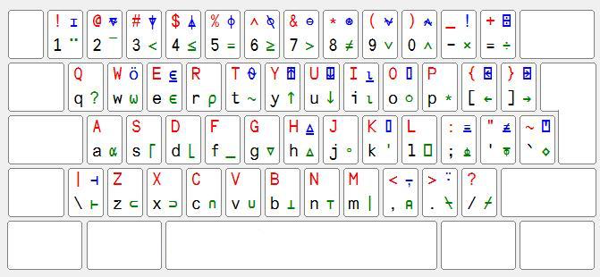

# [Outer Product as an Introduction to APL and a Pretty Cool Thing in General](https://www.youtube.com/watch?v=WlUHw4hC4OY)

## Keyboard Layout


## Function application
* prefix (monadic)
* infix (dyadic)
  * every function can be call monadically or dyadically
* very simple, either unary or binary
* evaluationg from right to left

## Argument to function
* Type of data
  * uncode code character
  * numbers (complex number)
  * lists

## Operator
* operator take functions as operand
  * result of operator with functions applied is called derived function
* functions take data as operand
* operator are third class citizen so that they can take second class citizen i.e. function as argument

## Parsing precedence
1. stranding (the result of stranding is always an argument)
2. oeprators (the result of operator evaluation is always a function) (left-to-right)
3. functions (right-to-left)

## Outer product example
* multiplication table
* counter the character occurences in a word 
* chinese menu
  * Anonymous function ⍺ ⍵
  * ⍵ right argument of the function
  * ⍺ left argument of the function
* pascal triangle
* commutative checker
  * function f is commutative if the outer product is symmetric

## useful operator
* ⍨ monadic swap operator
  * `f⍨` when applied monadically is same as apply f to argument itself
    * for example, `÷⍨ ⍳10` == `10 ⍴ 1`
* ∘. outer product
* ⍉ transpose
* ⍴
  * monadic function: shape
  * dyadic function: reshape

## Array programming
```
⍳2 3 4 ≡ (⍳2) ∘., (⍳3) ∘., (⍳4)
```

* ⍴ shape
  * category theory
  * the shape function transforms the monoid of arrays under operation `∘.,` to the monoid of lists of natrual number under `,`
  * `,` is assoiciative implies `∘.,` is associative
  * shape is called monoid homomorphism
* array v.s  nested list
  * nested list: no constraint, can have list of arbitrary length
  * array: constraint: every element in the array must have the same shape
    * array is an array of major cell
  * arrays are like static typing for lists

## rank operator
* ⍤ rank operator
  * take a function and a rank
  * specify which rank that this function will operator on
* Identity trick
  * use identity `⊢` to disambiguous between argument stranding

## scalar extenion
* relationship between scalar extension and outer product
  * `(-⍤0 1)` is the same as `∘.-`
  * outer product is simply the choice to extend both arguments in turn, along with the choice to put the axes of the left argument before those of the right

## outer product on function
* in the last chapter we talk about how to extend outer product to act on function instead of array
* outer product can also applied on array
```hs
outer f x y = fmap (\a -> fmap (f a) y) x
```
  * in usuall case x is list (array) so fmap is map over list
  * otherwise, if x is of type ((->) r) (i.e function) then
    * fmap is compose operator
  * (outer f g h) x y = f (g x) (h y)
* `on` in Data.Function in Haskell [ref](https://hackage.haskell.org/package/base-4.18.0.0/docs/Data-Function.html)
  * on b u x y run the binary operatur b on the result of applying u to x and y
  * on can be implemented by outer product on function
```hs
on = let self f x = f x x in self . outer
```
* why
```hs
on b u x y = (self (outer b) u) x y -- eta reduce
on b u = (self (outer b) u) -- eta reduce
on b u = self (outer b) u -- redundant bracket
on b = self (outer b) -- eta reduce
```
* 
f (g x) y == f . g
* where f is binary function

## Take away
* [context free grammar](https://mlochbaum.github.io/BQN/doc/context.html)
* rank polymorphism
* arrays are like static typing for lists
* APL is nice to debug since REPL is part of editor
* three mapping construct
  * outer product (explicit)
  * rank operator (implicit but given a rank to control it)
  * scalar extension (implicit)