## First-class resource in ML
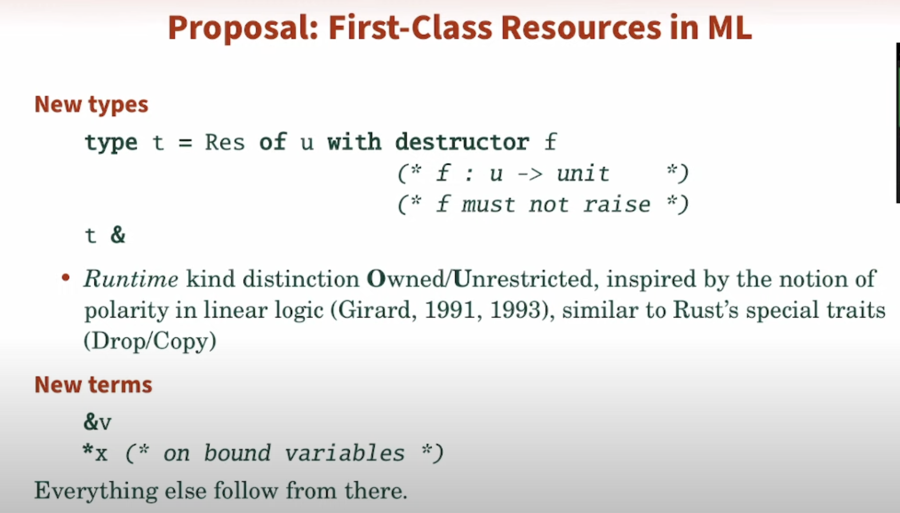
- #paper Practical Affine Types
    - affine - at most one
- **Automatic** Resource Management
    - stack allocation
    - unique pointers
    - reference-counted pointer (shared pointer)
        - Bad: cycle leaks, count-update is costly and inefficient
        - Good: timely resource destruction
        - Good: values did not move
    - RAII (rc=1)
        - GOOD
    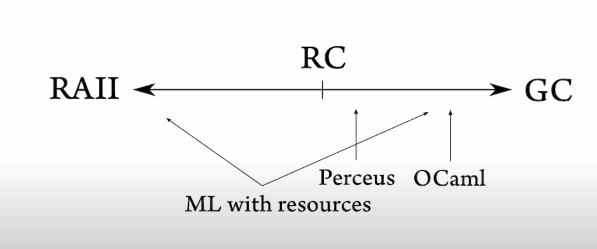
    - #g Forgetful Functor
        - Uniform representation  
    - low-hanging fruit for ownership

## SML/NJ
- REPL for native code generation on the fly
- Design philosophy of SML/NJ
    - system should be self contained and self supporting
        - external dependency
            - C
            - Shell
            - make
        - #problem lots of maintain issue 
- Modernization
    - streamlining and documenting existing code
    - wholesale rewrite of various components
- Architecture
    - SML compiler
    - Compilation manager
    - Runtime System
- #TLDR linking in lambda calculus is beta reduction (substitution rule)
    - #solution dynamically instantiated modules are represetned as tuples of dynamic values at runtime,  so structures and functors are compiled to functions that returns these tuples  
- Compilation pipeline
    - Absyn (AST) -> FLINT (F_w : [System F higher-order polymorphic lambda calculus](https://en.wikipedia.org/wiki/System_F#:~:text=Girard%2DReynolds%20Isomorphism.-,System%20Fω,a%20different%2C%20more%20complex%20system.)) -> CPS -> CPS -> Machine code
    - updated runtime system code to C99
- Main work: LLVM Code Generator
- #TLDR #g Runtime model is based on the heap allocated continuation
- #paper [MLRISC A framework for retargetable and optimizing compiler back ends](https://www.beroal.in.ua/prg/mlrisc/doc/mlrisc.pdf)
- Port to LLVM/IR
    - #problem  llvm is biased toward C like models
    - #solution #g Jump-wth-argument (JWA) conventions to support things
- Future work: Rewrite the runtime system
    - 1.6M lines of C++ code embedded
    - rewrite the runtime in C++
    - why C++
        - take advantage of C++ templates
        - make particular part of system more type safe
- "Type-safe" programming with SML values in C++
 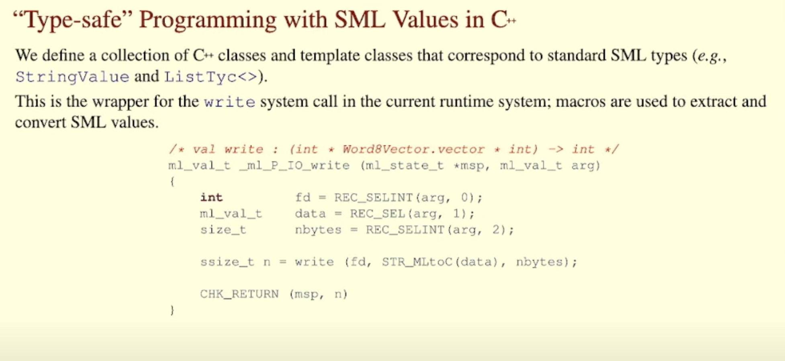
- Strong type
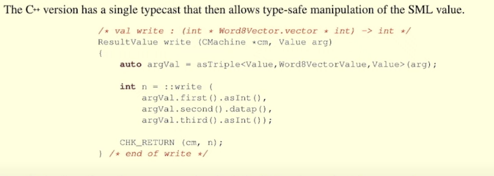

## LeoWhite Semi-Explicit Polymorphic Parameters
- What's a polymorphic parameter?
- #problem
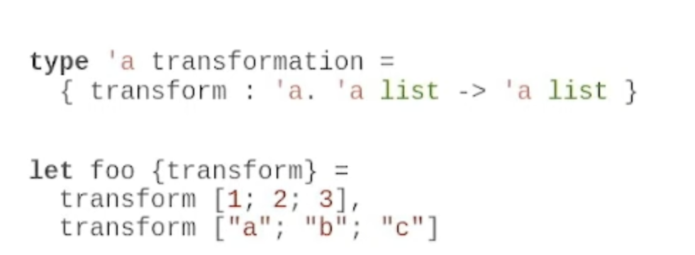
- very bad
- #goal 
```OCaml
let foo  (transform : 'a list -> 'a list) = 
    transform [1,2,3], transform ['a','b','c']
```
- #solution enhance function parameter
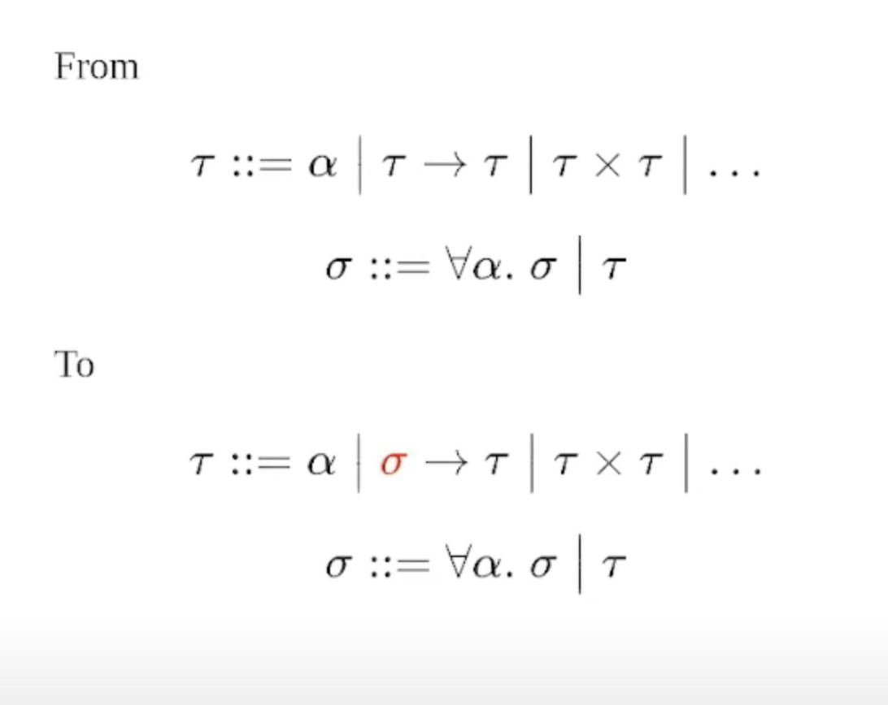
- Implementation in the type checking system
    - #g [Algorithm J](https://en.wikipedia.org/wiki/Hindley–Milner_type_system#Algorithm_J)
    - unification variables are represented by mutable state
    - #TLDR Type expressions becomes a graph rather than a tree

## Pretty printer library in SML
- YAPPL
    - yet another pretty printer library
- A history of PP
    - open
    - PPML
    - Hughes-Wadler
- #goal 
    - print compiler representation
        - for compiler debugging
- #solution taxonomy of layout
    - blocks
    - breaks
    - alignment (compact)
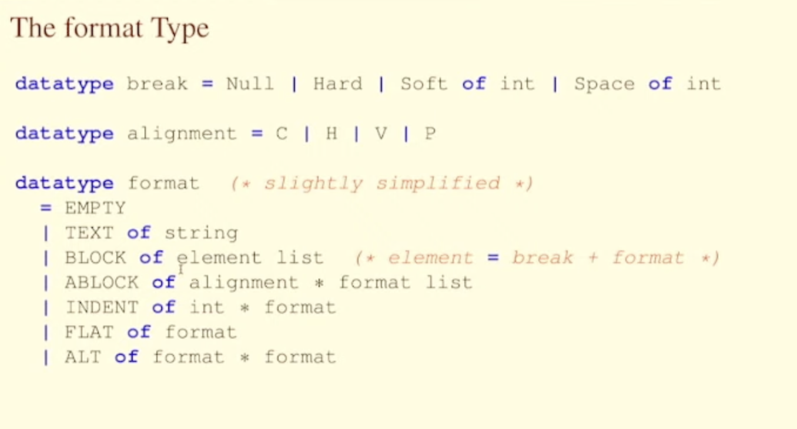
- #problem indentation
- #TLDR efficiency is achieved via limited look ahead (you only know how many characters left in this line)

## Exploring Perceus For OCaml
- Elton Pinto
    - Master thesis
    - UPenn
- Perceus
    - #lang Perceus: Garbage Free Reference Counting with Reuse
- Precise Reference Counting
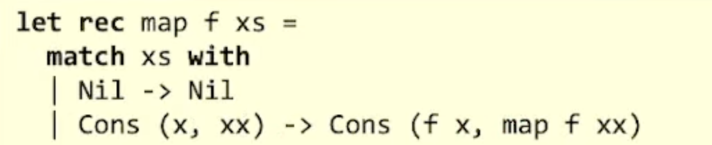
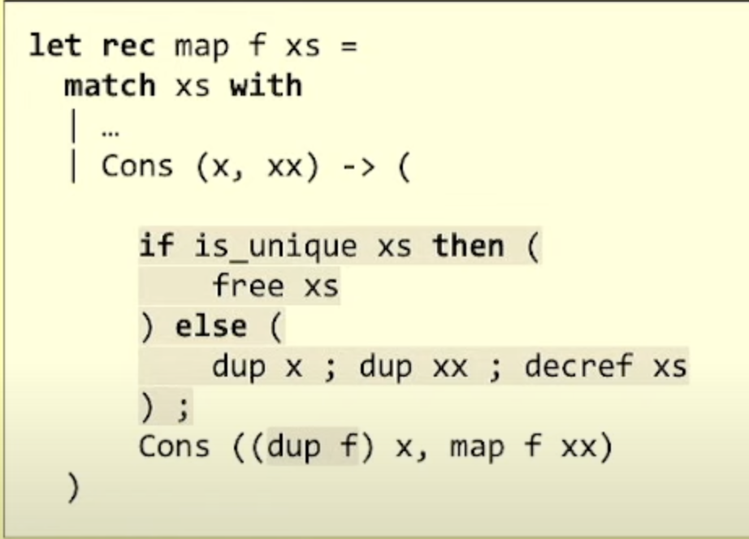
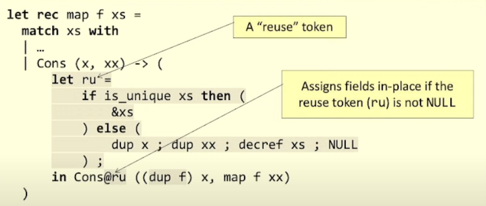
- primitive of perceus
    - dup
    - drop
    - decr
    - is-unique
    - alloc
    - free
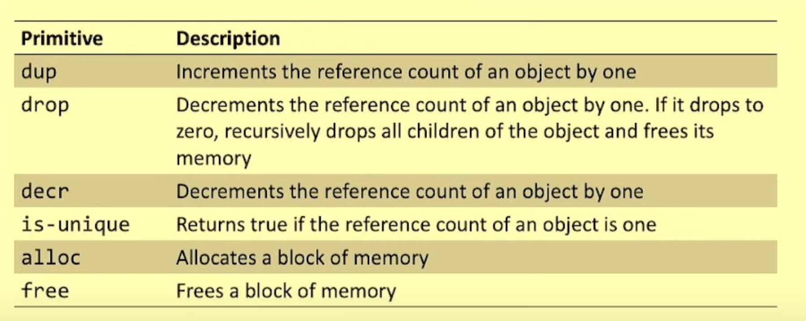
- Calling convention in OCaml
    - OCaml convention: All registers are caller-saved
    - C convention (The cdecl convention, used in ocaml)
- minalloc
    - C runtime
- we no longer need the GC by implementing the primitive of perceus paper
- #g [bump allocator](https://os.phil-opp.com/allocator-designs/#bump-allocator)
- #g [minalloc](https://github.com/microsoft/mimalloc)

## Array
- Immutable Array
- HPC
    - radical
    - assembly full control
- Single Assignment C
    - looks like C
    - feels like C
    - purely functional
    - n-dimensional **immutable** arrays
    - rank-polymorphism
    - **don't give programmer control of memory**
    - #goal 
- immutable
    - where does result go?
- #example c = a + b
    - where does memory for c from? by allocation? by reuse of a? by reuse of b?
- Why Rank Polymorphism Matters?
    - generic code?
    - morphism between iteration spaces!
        - reshape array
- #example scan
    - reshape
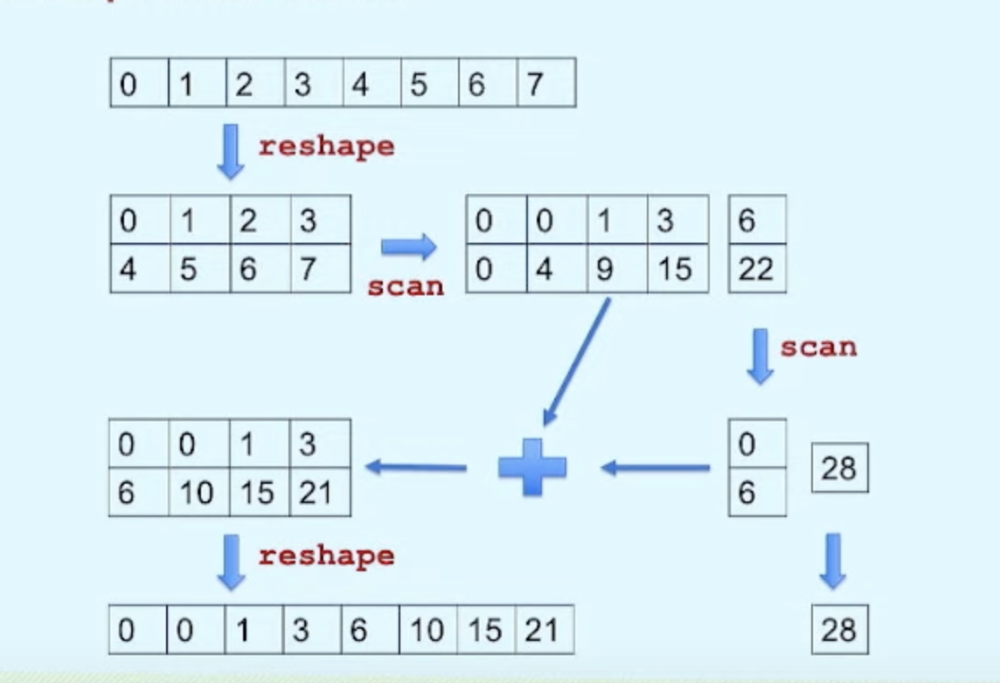
    - #revisit APL implementation of left scan
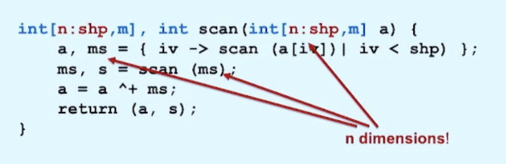
#paper array"22 paper
- Why Immutable?
    - rank-recursive algorithm do not match mutable array 
    - rank-recursive algorithm is good for
        - concurrency modelling (scan)
        - locality modelling
- #TLDR  in this model, the only way to introduce concurrency is by data parallelism
```
warm  cold
2-lwt-eio       : 6.24, 1.53
3-eio           : 6.06, 1.51
4-eio-multicore : 5.21, 0.55
```
## Summary
- [oxidizing ocam: janestreetl](https://blog.janestreet.com/oxidizing-ocaml-locality/)
- #project type-safe programming with SML values in C++
- #project effectful type checking algorithm Algorithm J
- #blog https://blog.janestreet.com/finding-memory-leaks-with-memtrace/
- #blog [polymorphic allocator](https://badlydrawnrod.github.io/posts/2021/12/28/allocators/)
- #g common sub expression elimnication using egraph
- #blog [Async/Await in rust](https://os.phil-opp.com/async-await/)
- #talk keynote tyde