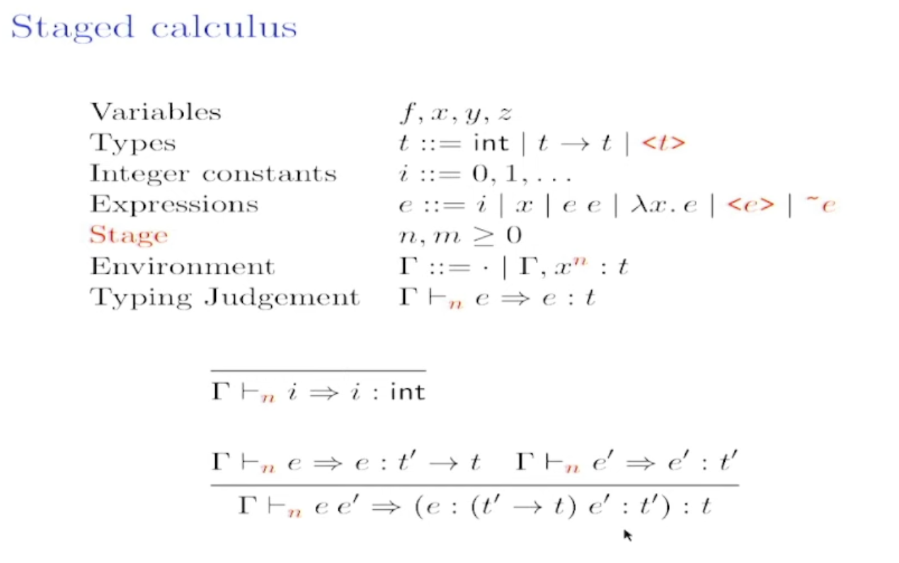

## Keynote Choice-based Learning
- #talk TensorFlow: Learning Functions at Scale (martin Abadi)
- What's a choice-based learning
    - Markov decision process
        - choose an action, get a reward (negative reward or positive reward)
        - #problem the tension between immediate rewards and long term reward with penalty in the middle
    - gradient descent
        - choose parameters, get a loss
- #example linear regression

    - gradient descent
        - choose the new parameters in the opposite direction of the derivative
- #tldr key idea: effect handlers for choice-based learning


- #g selection monad
- #g essential idea of effect handler: separation of syntax and semantics
    - syntax is defined by user-provided effect operations
    - semantics is given by handlers
    - A modular and flexible way to support structured control-flow abstractions
```haskell
data Eff e a
instance Monad (Eff e)
runEff :: Eff () a -> a

data Op a b
perform :: (h :? e) => Op a b -> a -> Eff e b
handler :: h -> Eff (h :* e) ans -> Eff e ans
```
- multishot continuation

- An example of using effect handlers to do gradient descent  

- Selection Monad
    - S(X) = (X -> R) -> X
    - continuous monad
        - cps r a =  (a -> r) -> r
- viewing selection monad as
    - R a set of losses
        - takes a loss continuation in (X->R)
        - and pick a X
- return a tuple of loss times original computation


- #example Hyperparameter optimization
    - #problem how to choose the best hyper parameter?

- Effect handlers for reinforcement learning
- Q-learning
- Sarsa algorithm

- compile to JAX  

- composing 

## FLambda2
- Middle end optimzer
    - closure - compilation speed is fast
    - Flambda - a more powerful optimizer but compilation is slow
- #problem Can we do run fast and  compile fast?
- #example Example of optimization => No allocation for pattern matching
```OCaml
type t = C | D | E
type s = A of int | B of int

let foo c a b =
    let m =
    match c with
    | C -> A a
    | D -> B b
    | E -> B (b + 1)
    in
    match m with
    | A x ->
    | B y ->
```
- #example iteration of ocaml looks like C code when compiling to assembly
- more example
    - inlining
    - unboxing
    - static allocation
    - CSE (common subexpression elimination)
- Phase
    - Lambda => Flambda 2
    - Simplification pass (perform optimization)
    - FLambda 2 => IR (Cmm)
- IR
    - CPS

- A OCaml file is single flambda2 term
- #example simplication
    1. downwards traversal
    2. a couple of fast fixpoint calculation
    3. upwards traversal rebuilding the term
- forward (downward) pass
- #g pdce
## Bioinformatics
- What's wrong with those people
- #motivation I study biology
    - people/horses/...
- People study biology is right brain
- People doing PL is left brain
- FOSDEM Talk
    - package manage system GNU Guix
    - #talk [Zig and Guile](https://archive.fosdem.org/2023/schedule/event/zigandguile/)
- Why
    - Guile (a language for binding C/C++ language)
    - Zig (C-ABI)
- Zig goodies
    - AVX (transparent vector compute)
    - excellent rt and ct 
- lisp repl is useful
- Why?
    - on strict typing
- garbage collection
    - binding with other languages
    - hurts when crossing language boundaries
- zig and lisp are small implementations
- C++ runtime libg++ are slower than C
- why package manager is bad?
    - don't limited to one language
    - package-manager don't do multi-language easily

## MacoOCaml
- Jeremy Yallop
- Safe and Efficient Generic Function with MacoCaml
    - customised compilation
- #motivation MacoCaml make difficult task easy 

- #problem ideally, print shall able to take arbitrary data and print them
    - #solution current solution
```OCaml
type intlist = int list [@@deriving eq]
```
    - ppx_deriving_standalone
```OCaml
type 'a id = ..
type ('a, 'b) iso = {
    out: 'a -> 'b
    in_: 'b -> 'a
} 
```
- fresh name
- ppx may not be safe
- #g copy what he does
- #example an unsafe but fast using ppx and a safe and not fast using run time types
- #problem safe and fast
- #solution macocaml
    - << >>
    - $
- type safety
    - macro of type a will generate program of type a
- 

## Essential of Compilation
- Having a denotational semantics we can trust for this weird langauge
    - operational based
- incremental approach

- Introduction to Compilers
    - pipeline layout of the compiler
        - parse (an arrow)
        - each pass has a very focus responsibility
        - nanopass approach
    - how to static analysis?
        - stashed meta data into AST
        - #solution consume metadata quickly
    - incremental approach for the compiler
        - vertical deployment
            - #example introduce data-flow analysis in while
    - graph coloring algorithm Inspired by soduko
    - flat closure ~ tuple ~ lambda
        - toy language feature
            - gradual typing
            - generics
            - lambda
            - dynamic
            - loops
    - custom calling conventions
    - 
- grammar
    - Prim Op exp*

- semantics is expressed by interpreter

- x86 assembly language

- prescriptive

- declarative
- imperative

- control flow is implicit
- control flow is explicit

- nanopass
    - select instruction
    - remove complex operands
    - explicate control
        - compiling with continuation
    - assign homes

- x86_var => x86_* => x86
- Andrew (OCaml) Portland state university. Andrew Tolmach

- monadic normal form


- #problem repeated assignments
    -  #solution pass the context to the recursive calls 
- incremental via inheritence
    - codeuse by inheritence
    
- #example code duplication in the nested if-then-else condition
- why does compiler use control flow graph?
- closure

- #course [CS578 Andrew Tolmach](https://web.cecs.pdx.edu/~apt/cs578_2022/)
- #course [Programming Languages Compilation](http://web.cecs.pdx.edu/~apt/cs510comp/)
## MetaOCaml Theory and Implementation
- convince myself of a validity
- How to implement MetaOCaml?
    - Brackets
    - Escape
- Typed Code Template
```OCaml
let c : int code = .<1+2>.
```
- Code template with a hole: splicing
```OCaml
let c = .<1+2>. in
let ch x = .<1 + .~x>. in
ch c
```
- #g multi-staging
    - #TLDR generate code that can generate code
- Staging and scoping
- Basic Calculus
- type_expect

- #g staged calculus

- translation
- translating bracket away
- TLDR
- on the earth content

- #g macro-ocaml
    - similarity: 
        - genearte code
    - difference
        - offshore: generate C code
    - ctypes
    
## OWI
- making an interpreter symbolic?
    - choice monad 
- Functorization a interpreter
- symbolic evaluation
    - evaluate both branches
- #g choice monad
    - continuation + state monad
- WASM is potential alternative to LLVM-IR
    - 
## summary
- #g fixpoint computation
- #g an interesting fiber implementation in Guile
- #summary Jeremy Yallop
- #paper compiling without continuation
- #people [Andrew Tolmach](http://web.cecs.pdx.edu/~apt/)
- #g idea
    - why lwt_eio engine is not performant?
        - read, register, notify, read (io_uring_prep_pull)
        - read, register, notify+read (io_uring_prep_read)
    - eventfd eio
    - eventfd interaction for eio is not exposed to the user
- #revisit #talk Last 40 minutes of essential of compilations https://www.youtube.com/watch?v=X9bT2GbhWoM